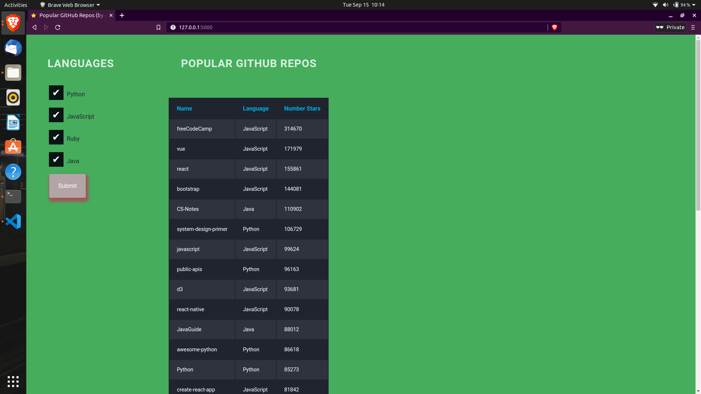

# Deployed using `PythonAnywhere`

Link: http://rgrupesh.pythonanywhere.com/
# To run locally:(LINUX and macOS)
1. clone
2. install flask from https://flask.palletsprojects.com/en/1.1.x/installation/
3. go to cloned dir. and run. `FLASK_APP=app.py flask run` 

# GitHub-Repo-Stars
